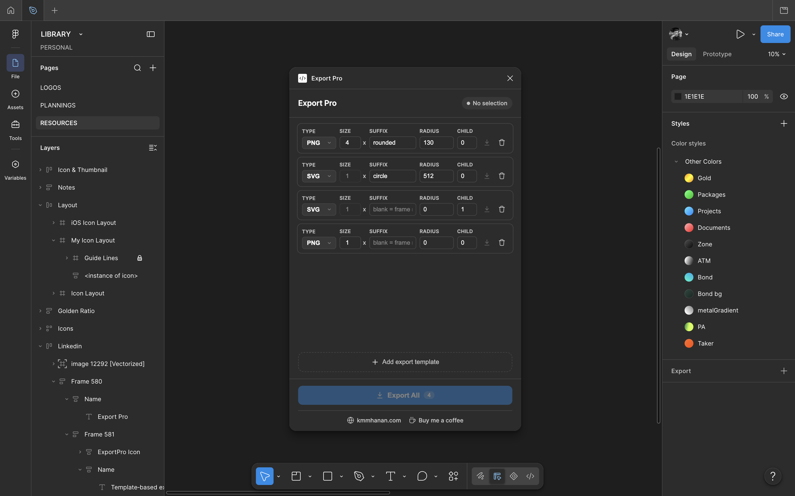

# 📦 Export Pro

**Persistent, template-based export presets for Figma.**
Define your export settings once — they stay put no matter what you select.

[Features](#-features) · [How it works](#-how-it-works) · [Install](docs/INSTALL.md) · [Build](docs/BUILD.md) · [Change the icon](docs/ICON.md) · [Publish](docs/PUBLISH.md)

---

## 🤔 The problem

Figma's built-in export panel is tied to the selected node. Select a different
frame and your export settings are gone — you rebuild them every time.

**Export Pro** keeps your export presets in the plugin's own storage instead
of on the node, so the same list of presets is always there, for any layer
you select.

## ✨ Features

- 🧩 **Persistent templates** — add as many export presets as you like (size,
  format, suffix, corner radius, nested-frame targeting); they survive
  selection changes and Figma restarts.
- 🎯 **Per-template export** — run just one preset against the current
  selection with its own mini "Export" button.
- 📦 **Export All** — run every preset at once; multiple outputs are bundled
  into a single `.zip` download automatically.
- 🖼️ **PNG, JPG, SVG, PDF** — scale is applied where it's meaningful (PNG/JPG)
  and ignored where it isn't (SVG/PDF).
- 🔵 **Temporary corner radius** — apply a border radius just for the export
  (e.g. to render a square icon as a circle) without permanently changing
  your design; the original radius is restored afterwards, even from a mixed
  state.
- 🪆 **Nested-node targeting** — export a node buried inside your selection
  (a frame, vector, image, or group — any type, at any depth) instead of
  only the top-level selection.

## 🧠 How it works

Each template has:

| Field             | Meaning                                                                                                                                                                          |
| ----------------- | -------------------------------------------------------------------------------------------------------------------------------------------------------------------------------- |
| `scale` (nx)      | Export scale (1x, 2x, 4x...). Ignored for SVG/PDF.                                                                                                                               |
| `format`          | `PNG`, `JPG`, `SVG`, or `PDF`.                                                                                                                                                   |
| `suffix`          | If set: filename is `<selected node name>-<suffix>.<ext>`. If blank: filename is the **target node's own name** instead.                                                         |
| `borderRadius`    | Corner radius applied _temporarily_ just before export (`0` = untouched).                                                                                                        |
| `childFrameDepth` | `0` = export the selected node itself. `N` = descend `N` levels, taking the first child at each level (frame, vector, image, group, component — any type), and export that node. |

### 🔍 Worked example — a frame named "test icon"

| Template                                         | Output                                                                                                                                                 |
| ------------------------------------------------ | ------------------------------------------------------------------------------------------------------------------------------------------------------ |
| `4x, PNG, suffix "rounded", radius 130, child 0` | `test icon-rounded.png`                                                                                                                                |
| `1x, SVG, suffix "circle", radius 512, child 0`  | `test icon-circle.svg`                                                                                                                                 |
| `1x, SVG, suffix "", radius 0, child 1`          | descends into the first child frame of "test icon" and exports _that_ frame, named after itself (e.g. `Frame 1.svg`). `child 2` goes one level deeper. |

## 📸 Screenshot

## 🚀 Getting started

- **Just want to use it?** → [`docs/INSTALL.md`](docs/INSTALL.md)
- **Want to build or modify it?** → [`docs/BUILD.md`](docs/BUILD.md)
- **Changing the plugin icon?** → [`docs/ICON.md`](docs/ICON.md)
- **Publishing a new version?** → [`docs/PUBLISH.md`](docs/PUBLISH.md)

## ⚠️ Notes / limitations

- Corner radius is restored per-corner after export, so it's safe to use on
  frames that previously had mixed corner radii.
- `childFrameDepth` only ever follows the _first_ child at each level,
  whatever type it is (frame, vector, image, group, component...). If a
  level has no children at all, that template is skipped with a toast
  notification instead of failing silently.
- Network access is disabled in the manifest (`networkAccess.allowedDomains:
["none"]`) — everything, including zipping, runs locally in the plugin UI.

## 🤝 Contributing

Issues and PRs welcome. Please run `npm run typecheck` before submitting.

## 📄 License

MIT © [Kmm Hanan](https://kmmhanan.com) — see [LICENSE](./LICENSE).
